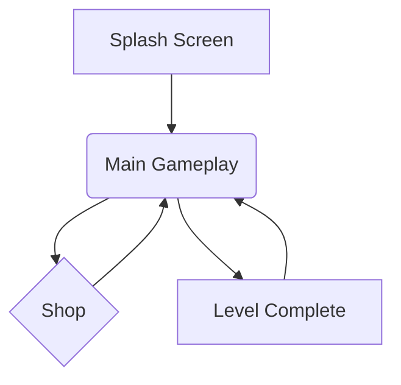

# **Пайплайн Разработки Гиперказуальных Игр v1.0: Руководство для Chief Architect**

### **Введение**

Этот документ является единым источником истины (Single Source of Truth) для конвейера по производству гиперказуальных HTML5-игр с использованием ИИ-ассистентов. Его цель — обеспечить предсказуемый, воспроизводимый и высококачественный результат на каждом этапе разработки, независимо от исполнителя.

### **Общая структура конвейера (v1.0)**

1.  **[Креативный блок]**
    *   ✅ **Этап 1: Idea Generation & Prototyping Brief (Генерация идей и бриф для прототипа)**
    *   ✅ **Этап 2: Viral Wrapper & Context Immersion (Поиск вирусной "обёртки")**
2.  **[Архитектурный блок]**
    *   ✅ **Этап 3.1: Blueprint Generator (Создание технического каркаса)**
    *   *Этап 3.1: Blueprint Generator (Создание технического каркаса)*
    *   *Этап 3.2: GDD-lite Generator (Создание гейм-дизайн документа)*
3.  **[Производственный блок]**
    *   *(...)*
4.  **[Аналитический блок]**
    *   *(...)*

---

## ➡️ **Этап 1: Idea Generation & Prototyping Brief**

#### **Цель**

Выполнить полный цикл генерации и профессиональной оценки идей, чтобы на выходе получить не просто список, а **полный пакет первичной документации (One-Pager, Gameplay Scenario, Task List) для 3 лучших идей-кандидатов**. Это позволяет принять финальное решение на основе максимально полной информации.

#### **Роль Chief Architect**

1.  Инициировать процесс с помощью эталонного промта.
2.  Изучить итоговую таблицу с 10 идеями.
3.  Глубоко проанализировать расширенные пакеты документов для Топ-3 идей.
4.  Выбрать **одну** идею-победителя для передачи на Этап 2.
5.  Сохранить весь вывод ИИ как артефакт `Stage1_Full_Report.md` и отдельно сохранить `One-Pager` победившей идеи как `One-Pager.md`.

#### **Входные данные**

*   Ничего. ИИ-ассистент должен иметь доступ к вебу для анализа актуальных трендов и данных.

#### **Процесс**

1.  Скопируйте **эталонный шаблон-промт `Stage1_PrototypingBrief_Generator`** в ИИ-ассистент.
2.  Убедитесь, что ИИ-ассистент имеет возможность выполнять длительные и сложные задачи.
3.  Получите на выходе полный отчет, включающий таблицу и расширенные блоки.
4.  Проведите анализ и выберите идею-победителя.
5.  Сохраните артефакты.

#### **Шаблон-промт: `Stage1_PrototypingBrief_Generator` (Эталон)**

```yaml
# РОЛЬ
Ты — веб-подключённый ИИ-ассистент, профи по гиперказуальным и HTML5-играм. 

# ЗАДАЧА
Твоя задача — выполнить полный первый этап генерации и профессиональной оценки идей для публикации на Yandex Games. 
Выходные форматы: 1) таблица 10 идей с кратким описанием и детальной оценкой, 2) расширенная папка (one-pager, gameplay scenario, task list) для Топ-3 игр.

# ШАГ 1: Генерация и оценка 10 идей
Сгенерируй 10 идей. Для каждой идеи предоставь:
- **Название (рабочее)**
- **Описание (1–2 предложения)**
- **Оценки по метрикам (от 1 до 5):** Implementation Complexity, Viral Potential, Retention Potential, Market Saturation, Monetization Fit, Legal/Mod Risk, Art/Asset Cost
- **Итоговый балл (от 0 до 100)** согласно весам: Impl 30%, Viral 20%, Retention 20%, Market 10%, Monet 10%, Risk 5%, Art 5%.
- **Время реализации (часы и рабочие дни)** для профилей: Optimistic (x0.7), Realistic (x1.0), Conservative (x1.6). Используй базовую таблицу задач: Core gameplay 8h, Flow 6h, UI 4h, Art 6h, Sound 2h, SDK 6h, Testing 6h, Packaging 4h (итого 42h) и увеличивай при дополнительных механиках.
- **Рекомендация движка/стека** (Phaser3 / Construct / Unity WebGL) с короткой причиной.
- **Минимальный набор ассетов** + оценка сложности арта.
- **Ключевые риски (1–2 шт.)**

# ШАГ 2: Глубокая проработка Топ-3 идей
На основе итогового балла выбери топ-3. Для каждого из них сгенерируй:
- **One-Pager:** название, жанр, тема, core loop, цель игрока, прогресс/мета, target session length, target D1/D7 retention (примерные целевые значения).
- **Полный Gameplay Scenario:** пошаговая проходимость, UI flows, edge cases, простые псевдокоды событий (spawn, death, score), примеры 10 коротких уровней/вариаций или примера бесконечного цикла.
- **Task list (микро-задачи):** с оценками часов по профилям (Optimistic/Realistic/Conservative) и зависимостями.
- **Набор промтов:** 
  - **Код:** «Напиши Phaser3 template для [механика]…»
  - **Art:** «Сгенерируй промты для Midjourney/Leonardo: стиль, цветовая палитра, список спрайтов…»
  - **Sound:** «Сгенерируй запросы для AI-sound…»
  - **Store text:** 3 варианта названий, 3 варианта короткого описания (80 chars) и 3 длинных описания (одно-два абзаца).
- **Рекомендации по монетизации** и позиции рекламы (rewarded, interstitial): конкретно где и почему.
- **Референсы (3 шт.):** похожие игры (название + краткий анализ — что взять, что улучшить).

# ШАГ 3: Финальный вывод
Сформируй вывод: какая идея является лучшим кандидатом для быстрой публикации (в течение 7–10 рабочих дней) при профиле «Realistic», и почему.

# ФОРМАТ ВЫВОДА
1.  **Таблица из 10 строк** (CSV или markdown table) с колонками: `id, name, short_desc, impl(1-5), viral(1-5), retention(1-5), market(1-5), monet(1-5), risk(1-5), art(1-5), final_score(0-100), time_opt_h, time_real_h, time_cons_h, recommended_engine`.
2.  **После таблицы — развёрнутые блоки для Top-3** (One-Pager + Gameplay Scenario + Task list + Prompts).
```

#### **Выходные данные (Артефакты)**

1.  **`Stage1_Full_Report.md`**: Полный вывод ИИ, содержащий таблицу и расширенные блоки для топ-3. Сохраняется для истории и анализа.
2.  **`One-Pager.md`**: Отдельный файл, содержащий только секцию `One-Pager` для **выбранной** идеи-победителя. Этот файл является входным для Этапа 2.

#### **Критерии приемки**

*   [ ] Получен полный отчет от ИИ, соответствующий формату вывода.
*   [ ] Проведен анализ топ-3 кандидатов.
*   [ ] Принято решение о выборе одной идеи-победителя.
*   [ ] Созданы и сохранены артефакты `Stage1_Full_Report.md` и `One-Pager.md`.

---

## ➡️ **Этап 2: Viral Wrapper & Context Immersion**

#### **Цель**

Превратить "сухую" игровую механику из `One-Pager` в несколько (3-5) конкретных, культурно-релевантных и вирусно-привлекательных концепций ("обёрток"). Выбрать лучшую обёртку для дальнейшей разработки на основе объективного, многофакторного анализа.

#### **Роль Chief Architect**

1.  Подготовить и запустить промт, передав в него содержимое `One-Pager.md`.
2.  Выбрать стратегию (`Reach` или `Retention`), которая определит веса в формуле оценки IZR.
3.  Проанализировать предложенные ИИ варианты, их оценки и финальную рекомендацию.
4.  Сформировать и сохранить итоговый артефакт — `Viral_Report.md`.

#### **Входные данные**

*   `One-Pager.md` (созданный на Этапе 1).
*   Выбор стратегии:
    *   **Reach (Охват):** Приоритет на максимальной виральности и низком CPI. Цель — быстрый всплеск популярности.
    *   **Retention (Удержание):** Приоритет на глубине и долгосрочном удержании. Цель — создание лояльной аудитории.

#### **Процесс**

1.  Скопируйте **эталонный шаблон-промт `Stage2_ViralWrapper_v2.0`** в ИИ-ассистент.
2.  Вставьте содержимое файла `One-Pager.md` в плейсхолдер `{{ONE_PAGER_TEXT}}`.
3.  Выберите и вставьте название стратегии в плейсхолдер `{{STRATEGY}}`. (Рекомендация по умолчанию: `Reach`).
4.  Получите на выходе детальный аналитический отчет.
5.  Создайте файл `Viral_Report.md` и скопируйте в него весь вывод ИИ-ассистента для передачи на Этап 3.

#### **Шаблон-промт: `Stage2_ViralWrapper_v2.0` (Эталон)**

```yaml
# РОЛЬ
Ты — креативный стратег и тренд-аналитик с опытом продюсирования в ведущих гиперказуальных издательствах. Твоя задача — не просто адаптировать идею, а *переизобрести* её, найдя для неё максимально мощный культурный и вирусный контекст, который зацепит миллионы игроков с первых секунд.

# ЦЕЛЬ
Провести полный исследовательский цикл и предоставить 3-5 альтернативных "вирусных обёрток" (Viral Wrappers) для базовой механики из входных данных. Каждая обёртка должна быть оценена по комплексной метрике IZR (Idea Zygosity Rating) с учётом выбранной стратегии.

# ВХОДНЫЕ ДАННЫЕ
---
## One-Pager игры:
{{ONE_PAGER_TEXT}}
---
## Целевая стратегия:
{{STRATEGY}} 
---

# ФОРМУЛА ОЦЕНКИ IZR (Idea Zygosity Rating)
IZR = (V*wV + E*wE + C*wC + N*wN) / (wV + wE + wC + wN)
- V (Viral Potential): Вероятность органического распространения, потенциал для мемов и UGC.
- E (Emotional Resonance): Сила и ясность эмоционального отклика (радость, азарт, удовлетворение).
- C (Cultural Embedness): Соответствие актуальным культурным паттернам, трендам и архетипам.
- N (Novelty): Оригинальность и свежесть формы или контекста, выделяющая игру на фоне конкурентов.

# ВЕСОВЫЕ КОЭФФИЦИЕНТЫ ДЛЯ СТРАТЕГИЙ
- **Reach:** wV=0.4, wE=0.2, wC=0.3, wN=0.1 (Приоритет на взрывной виральности и культурной релевантности)
- **Retention:** wV=0.2, wE=0.4, wC=0.3, wN=0.1 (Приоритет на сильной эмоциональной связи и культурной глубине)

# ЗАДАЧИ
1.  **Исследование (Web Research):** Проведи краткий анализ культурных и медийных трендов (TikTok, Reddit, YouTube, Google Trends), связанных с ключевыми элементами из One-Pager (механика, тема). Определи 2-3 мощных "культурных тока", которые можно использовать.
2.  **Генерация обёрток (Ideation):** На основе исследования предложи 3-5 уникальных Viral Wrappers. Для каждой обёртки предоставь:
    - **Название:** Яркое и запоминающееся.
    - **Нарративная суть:** Концепция и атмосфера (2-3 предложения).
    - **Ключевая эмоция:** Одно слово, ядро переживания игрока (например, "Любопытство", "Власть", "Гармония").
    - **Cultural Triggers:** Список конкретных культурных отсылок (мемы, архетипы, тренды).
    - **Формат распространения:** Как игроки будут делиться контентом (мем, челлендж, сторис, UGC).
3.  **Оценка (Evaluation):** Для каждой обёртки проведи оценку по шкале 1-10 для каждого параметра (V, E, C, N). Обоснуй каждую оценку, ссылаясь на данные из шага 1 (например, "V=9, так как формат напрямую повторяет популярный TikTok-челлендж X, имеющий 500k+ видео"). Рассчитай итоговый IZR.
4.  **Анализ (Analysis):** После описания всех вариантов, предоставь итоговый сравнительный анализ.

# ФОРМАТ ВЫВОДА
Вывод должен быть строго структурированным Markdown-документом. Не используй эмодзи.

---
### **Аналитический отчёт (Viral Wrapper & Context Immersion)**

#### **1. Аналитика трендов**
*(Краткое описание 2-3 ключевых культурных трендов, релевантных для данной механики, с примерами и ссылками)*

---
#### **2. Альтернативные обёртки (Viral Wrappers)**

##### **Вариант #1: [Название Wrapper-а]**
- **Нарративная суть:** ...
- **Ключевая эмоция:** ...
- **Cultural Triggers:** ...
- **Формат распространения:** ...
- **IZR Breakdown:**
  | Параметр | Оценка (1–10) | Комментарий (Обоснование оценки) |
  |---|---|---|
  | Viral Potential (V) | ... | ... |
  | Emotional Resonance (E) | ... | ... |
  | Cultural Embedness (C) | ... | ... |
  | Novelty (N) | ... | ... |
  | **IZR (avg)** | **...** | **...** |

*(Повторить для каждого варианта)*

---
#### **3. Итоговый анализ и рекомендации (Comparative Insight)**

- **Сравнительная таблица:**
  | Название обвязки | IZR | Ключевое преимущество | Основной риск |
  |---|---|---|---|
  | ... | ... | ... | ... |

- **Лучший вариант:** `[Название Wrapper-а с самым высоким IZR]`
- **Стратегическое обоснование:** *(2-4 предложения, объясняющие, почему этот вариант лучше всего соответствует выбранной стратегии 'Reach' или 'Retention' и имеет наибольшие шансы на успех)*
- **Идеи для гибридизации:** *(Список элементов из других вариантов, которые можно интегрировать в вариант-победитель для его усиления)*
---
```

#### **Выходные данные (Артефакт)**

*   Файл: `Viral_Report.md`
*   Содержимое: Полный текстовый вывод от ИИ-ассистента, соответствующий строгому формату выше.

#### **Критерии приемки**

*   [ ] В промт переданы корректные `One-Pager` и стратегия.
*   [ ] ИИ предоставил 3+ различных, логичных и креативных варианта "обёрток".
*   [ ] Расчет `IZR` для каждого варианта обоснован и подтвержден анализом трендов.
*   [ ] Итоговый `Viral_Report.md` сохранен и готов для передачи на Этап 3.

---

## ➡️ **Этап 3.1: Blueprint Generator (Создание технического каркаса)**

#### **Цель**

Трансформировать креативные документы (`One-Pager` и `Viral Report`) в **структурированный, машинно-читаемый технический каркас (Blueprint)**. Этот Blueprint является единым источником правды для всех последующих производственных этапов (кодинг, балансировка, генерация ассетов), исключая двусмысленность и необходимость "додумывать" механики.

#### **Роль Chief Architect**

1.  Подготовить входные данные, объединив `One-Pager` и `Viral Report`.
2.  Инициировать процесс генерации Blueprint с помощью эталонного промта.
3.  Провести валидацию полученных файлов (`Blueprint.json` и др.). Проверить на логическую целостность и соответствие идее.
4.  Сохранить артефакты в директории проекта для передачи на Этап 3.2.

#### **Входные данные**

*   `One-Pager.md` (из Этапа 1).
*   `Viral_Report.md` (из Этапа 2, содержит выбранную "обёртку").

#### **Процесс**

1.  Скопируйте **эталонный шаблон-промт `Stage3_BlueprintGenerator_v1.0`** в ИИ-ассистент.
2.  Вставьте содержимое файла `One-Pager.md` в плейсхолдер `{{ONE_PAGER_TEXT}}`.
3.  Вставьте содержимое файла `Viral_Report.md` в плейсхолдер `{{VIRAL_REPORT_TEXT}}`.
4.  Запустите генерацию. ИИ должен выдать несколько блоков кода с разными файлами.
5.  Создайте и сохраните соответствующие файлы (`Blueprint.json`, `entity_table.csv`, `screen_flow.mmd`) в папке проекта.

#### **Шаблон-промт: `Stage3_BlueprintGenerator_v1.0` (Эталон)**

```yaml
# РОЛЬ
Ты — AI Lead Technical Game Designer. Твоя задача — преобразовать высокоуровневые креативные документы в строгую, структурированную и машинно-читаемую техническую спецификацию (Blueprint). Ты мыслишь системами, сущностями, потоками данных и правилами. Ты должен исключить любую двусмысленность для последующих ИИ-ассистентов (Code, Art, QA).

# ЦЕЛЬ
Создать полный технический каркас (Blueprint) для гиперказуальной игры на основе предоставленных One-Pager и Viral Wrapper Report. Вывод должен состоять из трех частей: основного JSON-файла, таблицы сущностей в формате CSV и диаграммы экранов в формате Mermaid.

# ВХОДНЫЕ ДАННЫЕ
---
## One-Pager игры:
{{ONE_PAGER_TEXT}}
---
## Viral Wrapper & Context Report:
{{VIRAL_REPORT_TEXT}}
---

# ЗАДАЧИ
1.  **Проанализируй оба документа,** чтобы полностью понять ядро механики, выбранный культурный контекст ("обёртку") и ключевые особенности.
2.  **Спроектируй все игровые системы** и опиши их в строгом JSON-формате. JSON должен быть главным источником правды.
3.  **Детализируй все игровые сущности** в виде отдельной CSV-таблицы для удобства балансировки.
4.  **Визуализируй поток экранов** с помощью Mermaid-диаграммы.

# СТРУКТУРА ВЫВОДА
Предоставь результат в виде трёх отдельных, последовательных блоков кода.

### БЛОК 1: Основной Blueprint (формат JSON)
Создай `Blueprint.json`, который следует этой схеме:
```json
{
  "meta": {
    "game_title": "[Название из Viral Report]",
    "version": "1.0",
    "source_one_pager": "[Название из One-Pager]",
    "source_wrapper": "[Название Wrapper-а из Viral Report]"
  },
  "core_loop": [
    "[Шаг 1: например, Spawn]",
    "[Шаг 2: например, Merge]",
    "[Шаг 3: например, Reward]"
  ],
  "entities": [
    {
      "id": "[уникальный_id_сущности]",
      "type": "[item, currency, etc.]",
      "properties": {
        "merge_to": "[id_другой_сущности]",
        "generates_currency": { "currency_id": "coins", "amount_per_sec": 0.1 },
        "art_asset_ref": "[ссылка_на_ассет]"
      }
    }
  ],
  "economy": {
    "currencies": [
      { "id": "coins", "name": "Монеты" },
      { "id": "gems", "name": "Кристаллы" }
    ],
    "sources": [
      { "event": "onMerge", "reward": "coins" }
    ],
    "sinks": [
      { "action": "purchaseSlot", "cost": { "currency_id": "coins", "base_price": 100 } }
    ]
  },
  "screens": [
    {
      "id": "main_gameplay",
      "elements": ["grid", "spawn_button", "currency_display"],
      "transitions": { "on_shop_button_click": "shop_screen" }
    }
  ],
  "monetization_points": [
    { "id": "rewarded_video_skip_timer", "type": "RV", "context": "Ускорить таймер генератора" },
    { "id": "interstitial_on_level_complete", "type": "IV", "context": "После завершения главы/уровня" }
  ],
  "analytics_events": [
    { "event_name": "merge_success", "parameters": ["level", "entity_id"] },
    { "event_name": "session_start" }
  ]
}
```

### БЛОК 2: Таблица сущностей (формат CSV)
Создай `entity_table.csv` с деталями по каждой игровой сущности.
Пример:
```csv
entity_id,display_name,level,merge_to_id,coins_per_sec,unlock_cost
emoji_lvl1,Улыбка,1,emoji_lvl2,0,0
emoji_lvl2,Смех,2,emoji_lvl3,0.1,0
```

### БЛОК 3: Диаграмма экранов (формат Mermaid)
Создай `screen_flow.mmd` для визуализации переходов между экранами.
Пример:

```

#### **Выходные данные (Артефакты)**

1.  **`Blueprint.json`**: Основной технический документ, описывающий всю игровую логику в машинно-читаемом формате.
2.  **`entity_table.csv`**: Таблица для быстрой настройки и балансировки игровых объектов.
3.  **`screen_flow.mmd`**: Визуальная карта UI/UX для понимания пользовательского пути.

#### **Критерии приемки**

*   [ ] `Blueprint.json` создан, валиден и полностью соответствует предложенной схеме.
*   [ ] `Blueprint.json` логически непротиворечив и отражает как механику из `One-Pager`, так и тему из `Viral_Report`.
*   [ ] `entity_table.csv` и `screen_flow.mmd` сгенерированы и соответствуют данным из основного Blueprint.
*   [ ] Все артефакты сохранены и готовы для передачи на Этап 3.2.

