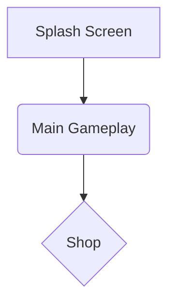

Принято. Ты абсолютно прав. Документ должен быть целостным, исчерпывающим и не содержать сокращений. Это основа воспроизводимости.

Я подготовил полную версию **"Пайплайн Разработки Гиперказуальных Игр v1.0"**, включающую все этапы с 1 по 6. Этот документ является эталонным руководством, которое отражает все наши решения, доработки и лучшие практики. Каждый шаблон-промт представлен в своей финальной, наиболее мощной версии.

---

# **Пайплайн Разработки Гиперказуальных Игр v1.0: Руководство для Chief Architect**

### **Введение**

Этот документ является единым источником истины (Single Source of Truth) для конвейера по производству гиперказуальных HTML5-игр с использованием ИИ-ассистентов. Его цель — обеспечить предсказуемый, воспроизводимый и высококачественный результат на каждом этапе разработки, независимо от исполнителя.

### **Общая структура конвейера (v1.0)**

1.  **[Креативный блок]**
    *   ✅ **Этап 1: Idea Generation & Prototyping Brief**
    *   ✅ **Этап 2: Viral Wrapper & Context Immersion**
2.  **[Архитектурный блок]**
    *   ✅ **Этап 3.1: Blueprint Generator**
    *   ✅ **Этап 3.2: GDD-lite Generator**
3.  **[Производственный блок]**
    *   ✅ **Этап 4: Production Planning & Task Decomposition**
    *   ✅ **Этап 5.1: Art Asset Prompting & Generation**
    *   ✅ **Этап 5.2: Sound Asset Prompting & Generation**
    *   ➡️ **Этап 6: Prototype Assembly (Сборка прототипа)**
    *   *Этап 7: QA, Balancing & Publishing (Тестирование и публикация)*
4.  **[Аналитический блок]**
    *   *Этап 8: Post-Launch Analysis (Анализ после запуска)*

---

## ➡️ **Этап 1: Idea Generation & Prototyping Brief**

#### **Цель**
Выполнить полный цикл генерации и профессиональной оценки идей, чтобы на выходе получить не просто список, а **полный пакет первичной документации (One-Pager, Gameplay Scenario, Task List) для 3 лучших идей-кандидатов**. Это позволяет принять финальное решение на основе максимально полной информации.

#### **Роль Chief Architect**
1.  Инициировать процесс с помощью эталонного промта.
2.  Изучить итоговую таблицу с 10 идеями.
3.  Глубоко проанализировать расширенные пакеты документов для Топ-3 идей.
4.  Выбрать **одну** идею-победителя для передачи на Этап 2.
5.  Сохранить весь вывод ИИ как артефакт `Stage1_Full_Report.md` и отдельно сохранить `One-Pager` победившей идеи как `One-Pager.md`.

#### **Входные данные**
*   Ничего. ИИ-ассистент должен иметь доступ к вебу для анализа актуальных трендов и данных.

#### **Процесс**
1.  Скопируйте **эталонный шаблон-промт `Stage1_PrototypingBrief_Generator`** в ИИ-ассистент.
2.  Убедитесь, что ИИ-ассистент имеет возможность выполнять длительные и сложные задачи.
3.  Получите на выходе полный отчет, включающий таблицу и расширенные блоки.
4.  Проведите анализ и выберите идею-победителя.
5.  Сохраните артефакты.

#### **Шаблон-промт: `Stage1_PrototypingBrief_Generator` (Эталон)**
```yaml
# РОЛЬ
Ты — веб-подключённый ИИ-ассистент, профи по гиперказуальным и HTML5-играм. 

# ЗАДАЧА
Твоя задача — выполнить полный первый этап генерации и профессиональной оценки идей для публикации на Yandex Games. 
Выходные форматы: 1) таблица 10 идей с кратким описанием и детальной оценкой, 2) расширенная папка (one-pager, gameplay scenario, task list) для Топ-3 игр.

# ШАГ 1: Генерация и оценка 10 идей
Сгенерируй 10 идей. Для каждой идеи предоставь:
- **Название (рабочее)**
- **Описание (1–2 предложения)**
- **Оценки по метрикам (от 1 до 5):** Implementation Complexity, Viral Potential, Retention Potential, Market Saturation, Monetization Fit, Legal/Mod Risk, Art/Asset Cost
- **Итоговый балл (от 0 до 100)** согласно весам: Impl 30%, Viral 20%, Retention 20%, Market 10%, Monet 10%, Risk 5%, Art 5%.
- **Время реализации (часы и рабочие дни)** для профилей: Optimistic (x0.7), Realistic (x1.0), Conservative (x1.6). Используй базовую таблицу задач: Core gameplay 8h, Flow 6h, UI 4h, Art 6h, Sound 2h, SDK 6h, Testing 6h, Packaging 4h (итого 42h) и увеличивай при дополнительных механиках.
- **Рекомендация движка/стека** (Phaser3 / Construct / Unity WebGL) с короткой причиной.
- **Минимальный набор ассетов** + оценка сложности арта.
- **Ключевые риски (1–2 шт.)**

# ШАГ 2: Глубокая проработка Топ-3 идей
На основе итогового балла выбери топ-3. Для каждого из них сгенерируй:
- **One-Pager:** название, жанр, тема, core loop, цель игрока, прогресс/мета, target session length, target D1/D7 retention (примерные целевые значения).
- **Полный Gameplay Scenario:** пошаговая проходимость, UI flows, edge cases, простые псевдокоды событий (spawn, death, score), примеры 10 коротких уровней/вариаций или примера бесконечного цикла.
- **Task list (микро-задачи):** с оценками часов по профилям (Optimistic/Realistic/Conservative) и зависимостями.
- **Набор промтов:** 
  - **Код:** «Напиши Phaser3 template для [механика]…»
  - **Art:** «Сгенерируй промты для Midjourney/Leonardo: стиль, цветовая палитра, список спрайтов…»
  - **Sound:** «Сгенерируй запросы для AI-sound…»
  - **Store text:** 3 варианта названий, 3 варианта короткого описания (80 chars) и 3 длинных описания (одно-два абзаца).
- **Рекомендации по монетизации** и позиции рекламы (rewarded, interstitial): конкретно где и почему.
- **Референсы (3 шт.):** похожие игры (название + краткий анализ — что взять, что улучшить).

# ШАГ 3: Финальный вывод
Сформируй вывод: какая идея является лучшим кандидатом для быстрой публикации (в течение 7–10 рабочих дней) при профиле «Realistic», и почему.

# ФОРМАТ ВЫВОДА
1.  **Таблица из 10 строк** (CSV или markdown table) с колонками: `id, name, short_desc, impl(1-5), viral(1-5), retention(1-5), market(1-5), monet(1-5), risk(1-5), art(1-5), final_score(0-100), time_opt_h, time_real_h, time_cons_h, recommended_engine`.
2.  **После таблицы — развёрнутые блоки для Top-3** (One-Pager + Gameplay Scenario + Task list + Prompts).
```

#### **Выходные данные (Артефакты)**
*   **`Stage1_Full_Report.md`**: Полный вывод ИИ, содержащий таблицу и расширенные блоки для топ-3.
*   **`One-Pager.md`**: Отдельный файл, содержащий только секцию `One-Pager` для **выбранной** идеи-победителя.

#### **Критерии приемки**
*   [ ] Получен полный отчет от ИИ, соответствующий формату вывода.
*   [ ] Проведен анализ топ-3 кандидатов.
*   [ ] Принято решение о выборе одной идеи-победителя.
*   [ ] Созданы и сохранены артефакты `Stage1_Full_Report.md` и `One-Pager.md`.

---

## ➡️ **Этап 2: Viral Wrapper & Context Immersion**

#### **Цель**
Превратить "сухую" игровую механику из `One-Pager` в несколько (3-5) конкретных, культурно-релевантных и вирусно-привлекательных концепций ("обёрток"). Выбрать лучшую обёртку для дальнейшей разработки на основе объективного, многофакторного анализа.

#### **Роль Chief Architect**
1.  Подготовить и запустить промт, передав в него содержимое `One-Pager.md`.
2.  Выбрать стратегию (`Reach` или `Retention`), которая определит веса в формуле оценки IZR.
3.  Проанализировать предложенные ИИ варианты, их оценки и финальную рекомендацию.
4.  Сформировать и сохранить итоговый артефакт — `Viral_Report.md`.

#### **Входные данные**
*   `One-Pager.md` (созданный на Этапе 1).
*   Выбор стратегии: **Reach** или **Retention**.

#### **Процесс**
1.  Скопируйте **эталонный шаблон-промт `Stage2_ViralWrapper_v2.0`** в ИИ-ассистент с доступом к вебу.
2.  Вставьте содержимое файла `One-Pager.md` в плейсхолдер `{{ONE_PAGER_TEXT}}`.
3.  Выберите и вставьте название стратегии в плейсхолдер `{{STRATEGY}}`.
4.  Получите на выходе детальный аналитический отчет.
5.  Создайте файл `Viral_Report.md` и скопируйте в него весь вывод ИИ-ассистента.

#### **Шаблон-промт: `Stage2_ViralWrapper_v2.0` (Эталон)**
```yaml
# РОЛЬ
Ты — креативный стратег и тренд-аналитик с опытом продюсирования в ведущих гиперказуальных издательствах. Твоя задача — не просто адаптировать идею, а *переизобрести* её, найдя для неё максимально мощный культурный и вирусный контекст, который зацепит миллионы игроков с первых секунд.

# ЦЕЛЬ
Провести полный исследовательский цикл и предоставить 3-5 альтернативных "вирусных обёрток" (Viral Wrappers) для базовой механики из входных данных. Каждая обёртка должна быть оценена по комплексной метрике IZR (Idea Zygosity Rating) с учётом выбранной стратегии.

# ВХОДНЫЕ ДАННЫЕ
---
## One-Pager игры:
{{ONE_PAGER_TEXT}}
---
## Целевая стратегия:
{{STRATEGY}} 
---

# ФОРМУЛА ОЦЕНКИ IZR (Idea Zygosity Rating)
IZR = (V*wV + E*wE + C*wC + N*wN) / (wV + wE + wC + wN)
- V (Viral Potential): Вероятность органического распространения, потенциал для мемов и UGC.
- E (Emotional Resonance): Сила и ясность эмоционального отклика (радость, азарт, удовлетворение).
- C (Cultural Embedness): Соответствие актуальным культурным паттернам, трендам и архетипам.
- N (Novelty): Оригинальность и свежесть формы или контекста, выделяющая игру на фоне конкурентов.

# ВЕСОВЫЕ КОЭФФИЦИЕНТЫ ДЛЯ СТРАТЕГИЙ
- **Reach:** wV=0.4, wE=0.2, wC=0.3, wN=0.1 (Приоритет на взрывной виральности и культурной релевантности)
- **Retention:** wV=0.2, wE=0.4, wC=0.3, wN=0.1 (Приоритет на сильной эмоциональной связи и культурной глубине)

# ЗАДАЧИ
1.  **Исследование (Web Research):** Проведи краткий анализ культурных и медийных трендов (TikTok, Reddit, YouTube, Google Trends), связанных с ключевыми элементами из One-Pager (механика, тема). Определи 2-3 мощных "культурных тока", которые можно использовать.
2.  **Генерация обёрток (Ideation):** На основе исследования предложи 3-5 уникальных Viral Wrappers. Для каждой обёртки предоставь:
    - **Название:** Яркое и запоминающееся.
    - **Нарративная суть:** Концепция и атмосфера (2-3 предложения).
    - **Ключевая эмоция:** Одно слово, ядро переживания игрока (например, "Любопытство", "Власть", "Гармония").
    - **Cultural Triggers:** Список конкретных культурных отсылок (мемы, архетипы, тренды).
    - **Формат распространения:** Как игроки будут делиться контентом (мем, челлендж, сторис, UGC).
3.  **Оценка (Evaluation):** Для каждой обёртки проведи оценку по шкале 1-10 для каждого параметра (V, E, C, N). Обоснуй каждую оценку, ссылаясь на данные из шага 1. Рассчитай итоговый IZR.
4.  **Анализ (Analysis):** После описания всех вариантов, предоставь итоговый сравнительный анализ.

# ФОРМАТ ВЫВОДА
Вывод должен быть строго структурированным Markdown-документом. Не используй эмодзи.

---
### **Аналитический отчёт (Viral Wrapper & Context Immersion)**

#### **1. Аналитика трендов**
*(Краткое описание 2-3 ключевых культурных трендов с примерами и ссылками)*

---
#### **2. Альтернативные обёртки (Viral Wrappers)**

##### **Вариант #1: [Название Wrapper-а]**
- **Нарративная суть:** ...
- **Ключевая эмоция:** ...
- **Cultural Triggers:** ...
- **Формат распространения:** ...
- **IZR Breakdown:**
  | Параметр | Оценка (1–10) | Комментарий (Обоснование оценки) |
  |---|---|---|
  | Viral Potential (V) | ... | ... |
  | Emotional Resonance (E) | ... | ... |
  | Cultural Embedness (C) | ... | ... |
  | Novelty (N) | ... | ... |
  | **IZR (avg)** | **...** | **...** |

*(Повторить для каждого варианта)*

---
#### **3. Итоговый анализ и рекомендации (Comparative Insight)**

- **Сравнительная таблица:**
  | Название обвязки | IZR | Ключевое преимущество | Основной риск |
  |---|---|---|---|
  | ... | ... | ... | ... |

- **Лучший вариант:** `[Название Wrapper-а с самым высоким IZR]`
- **Стратегическое обоснование:** *(2-4 предложения, объясняющие выбор)*
- **Идеи для гибридизации:** *(Список элементов из других вариантов для усиления)*
---
```

#### **Выходные данные (Артефакт)**
*   `Viral_Report.md`: Полный вывод ИИ, готовый для передачи на Этап 3.

#### **Критерии приемки**
*   [ ] В промт переданы корректные `One-Pager` и стратегия.
*   [ ] ИИ предоставил 3+ различных варианта "обёрток".
*   [ ] Расчет `IZR` для каждого варианта обоснован анализом трендов.
*   [ ] Итоговый `Viral_Report.md` сохранен.

---

## ➡️ **Этап 3.1: Blueprint Generator (Создание технического каркаса)**

#### **Цель**
Трансформировать креативные документы (`One-Pager` и `Viral Report`) в **структурированный, машинно-читаемый технический каркас (Blueprint)**. Этот Blueprint является единым источником правды для всех последующих производственных этапов.

#### **Роль Chief Architect**
1.  Подготовить входные данные.
2.  Инициировать процесс генерации Blueprint с помощью эталонного промта.
3.  Провести валидацию полученных файлов (`Blueprint.json`, `entity_table.csv`, `screen_flow.mmd`).
4.  Сохранить артефакты для передачи на Этап 3.2.

#### **Входные данные**
*   `One-Pager.md` (из Этапа 1).
*   `Viral_Report.md` (из Этапа 2).

#### **Процесс**
1.  Скопируйте **эталонный шаблон-промт `Stage3_BlueprintGenerator_v1.0`** в ИИ-ассистент.
2.  Вставьте содержимое файла `One-Pager.md` в плейсхолдер `{{ONE_PAGER_TEXT}}`.
3.  Вставьте содержимое файла `Viral_Report.md` в плейсхолдер `{{VIRAL_REPORT_TEXT}}`.
4.  Запустите генерацию.
5.  Создайте и сохраните соответствующие файлы (`Blueprint.json`, `entity_table.csv`, `screen_flow.mmd`).

#### **Шаблон-промт: `Stage3_BlueprintGenerator_v1.0` (Эталон)**
```yaml
# РОЛЬ
Ты — AI Lead Technical Game Designer. Твоя задача — преобразовать высокоуровневые креативные документы в строгую, структурированную и машинно-читаемую техническую спецификацию (Blueprint). Ты мыслишь системами, сущностями, потоками данных и правилами.

# ЦЕЛЬ
Создать полный технический каркас (Blueprint) для гиперказуальной игры. Вывод должен состоять из трех частей: основного JSON-файла, таблицы сущностей в формате CSV и диаграммы экранов в формате Mermaid.

# ВХОДНЫЕ ДАННЫЕ
---
## One-Pager игры:
{{ONE_PAGER_TEXT}}
---
## Viral Wrapper & Context Report:
{{VIRAL_REPORT_TEXT}}
---

# ЗАДАЧИ
1.  **Анализируй оба документа,** чтобы понять ядро механики и выбранный культурный контекст ("обёртку").
2.  **Спроектируй все игровые системы** и опиши их в строгом JSON-формате. JSON должен быть главным источником правды.
3.  **Детализируй все игровые сущности** в виде отдельной CSV-таблицы.
4.  **Визуализируй поток экранов** с помощью Mermaid-диаграммы.

# СТРУКТУРА ВЫВОДА
Предоставь результат в виде трёх отдельных, последовательных блоков кода.

### БЛОК 1: Основной Blueprint (формат JSON)
Создай `Blueprint.json`, который следует этой схеме (ты можешь добавлять новые корневые ключи, такие как "systems", если это необходимо для полноты описания):
```json
{
  "meta": { "game_title": "", "version": "1.0", "source_one_pager": "", "source_wrapper": "" },
  "core_loop": [],
  "entities": [ { "id": "", "type": "", "properties": {} } ],
  "economy": { "currencies": [], "sources": [], "sinks": [] },
  "screens": [ { "id": "", "elements": [], "transitions": {} } ],
  "monetization_points": [ { "id": "", "type": "", "context": "" } ],
  "analytics_events": [ { "event_name": "", "parameters": [] } ]
}
```

### БЛОК 2: Таблица сущностей (формат CSV)
Создай `entity_table.csv` с деталями по каждой игровой сущности.
Пример: `entity_id,display_name,level,merge_to_id,coins_per_sec,unlock_cost`

### БЛОК 3: Диаграмма экранов (формат Mermaid)
Создай `screen_flow.mmd` для визуализации переходов между экранами.
Пример:

```

#### **Выходные данные (Артефакты)**
*   `Blueprint.json`: Основной технический документ.
*   `entity_table.csv`: Таблица для балансировки.
*   `screen_flow.mmd`: Визуальная карта UI/UX.

#### **Критерии приемки**
*   [ ] `Blueprint.json` создан, валиден и логически непротиворечив.
*   [ ] `entity_table.csv` и `screen_flow.mmd` сгенерированы и соответствуют данным из Blueprint.
*   [ ] Все артефакты сохранены.

---

## ➡️ **Этап 3.2: GDD-lite Generator (Создание гейм-дизайн документа)**

#### **Цель**
Сгенерировать **полноценный, но лаконичный Гейм-дизайн Документ (GDD-lite)**, объединив техническую структуру из `Blueprint.json` с креативным видением из `Viral Report`.

#### **Роль Chief Architect**
1.  Подготовить входные данные.
2.  Инициировать процесс генерации GDD-lite.
3.  Провести ревью полученного документа.
4.  Сохранить итоговый `GDD-lite.md`.

#### **Входные данные**
*   `One-Pager.md`, `Viral_Report.md`, `Blueprint.json`.

#### **Процесс**
1.  Скопируйте **эталонный шаблон-промт `Stage3_GDDliteGenerator_v1.0`** в ИИ-ассистент.
2.  Вставьте содержимое файлов в соответствующие плейсхолдеры.
3.  Запустите генерацию.
4.  Создайте и сохраните итоговый файл `GDD-lite.md`.

#### **Шаблон-промт: `Stage3_GDDliteGenerator_v1.0` (Эталон)**
```yaml
# РОЛЬ
Ты — AI Lead Game Designer, мастер превращения технических спецификаций и креативных брифов в ясные, вдохновляющие и функциональные гейм-дизайн документы (GDD). Твоя задача — не придумывать новое, а синтезировать, структурировать и красноречиво описать уже существующее видение.

# ЦЕЛЬ
Создать исчерпывающий, но лаконичный GDD-lite в формате Markdown на основе трех предоставленных документов: One-Pager, Viral Wrapper Report и технического Blueprint.json.

# ВХОДНЫЕ ДАННЫЕ
---
## 1. One-Pager игры:
{{ONE_PAGER_TEXT}}
---
## 2. Viral Wrapper & Context Report:
{{VIRAL_REPORT_TEXT}}
---
## 3. Технический Blueprint (JSON):
{{BLUEPRINT_JSON}}
---

# ЗАДАЧИ
1.  **Проанализируй все три документа.**
2.  **Синтезируй информацию** и заполни 10 разделов GDD-lite, как указано в СТРУКТУРЕ ВЫВОДА.
3.  **Пиши ясно и кратко.** Используй данные из Blueprint для описания механик, а язык из Viral Report для описания сеттинга.
4.  **Добавь раздел "Требования к ИИ-ассистентам"** для использования в автоматизированном пайплайне.
5.  **Оцени качество получившегося GDD** по внутренней формуле и предоставь итоговый скор.

# СТРУКТУРА ВЫВОДА
Предоставь результат в виде единого Markdown-документа со строгой структурой из 10 разделов (1. Game Overview, 2. Gameplay Core, 3. Wrapper & Context, 4. Art & Audio, 5. Monetization, 6. Viral Mechanics, 7. Blueprint Metrics, 8. AI Production Chain, 9. Technical Summary, 10. Roadmap) и финальной оценкой GDDscore.
```

#### **Выходные данные (Артефакт)**
*   `GDD-lite.md`: Финальный гейм-дизайн документ.

#### **Критерии приемки**
*   [ ] GDD-lite сгенерирован и содержит все 10 обязательных разделов.
*   [ ] Документ логически связывает информацию из всех трех входных документов.
*   [ ] Итоговый GDDscore рассчитан и обоснован.
*   [ ] Артефакт `GDD-lite.md` сохранен.

---

## ➡️ **Этап 4: Production Planning & Task Decomposition**

#### **Цель**
Декомпозировать `GDD-lite` и `Blueprint.json` в **исчерпывающий, приоритизированный и машино-читаемый бэклог (backlog)**, а также создать **гайд по стилю (`Character_Style_Guide.md`)** для обеспечения консистентности арта.

#### **Роль Chief Architect**
1.  Подготовить входные данные.
2.  Инициировать процесс планирования.
3.  Провести валидацию полученных `backlog.json` и `Character_Style_Guide.md`.
4.  Сохранить артефакты.

#### **Входные данные**
*   `GDD-lite.md`, `Blueprint.json`.

#### **Процесс**
1.  Скопируйте **эталонный шаблон-промт `Stage4_ProductionPlanner_v1.1`** в ИИ-ассистент.
2.  Вставьте содержимое файлов в плейсхолдеры.
3.  Получите на выходе два документа.
4.  Создайте и сохраните файлы `backlog.json` и `Character_Style_Guide.md`.

#### **Шаблон-промт: `Stage4_ProductionPlanner_v1.1` (Эталон)**
```yaml
# РОЛЬ
Ты — AI Senior Producer, эксперт по Agile-методологиям и планированию в геймдеве.

# ЦЕЛЬ
1.  Декомпозировать предоставленные GDD-lite и Blueprint.json в машино-читаемый бэклог (JSON), сфокусированный на MVP.
2.  Создать краткий, но исчерпывающий гайд по стилю (`Character_Style_Guide.md`) для обеспечения консистентности арта.

# ВХОДНЫЕ ДАННЫЕ
---
## 1. GDD-lite Документ:
{{GDD_LITE_TEXT}}
---
## 2. Технический Blueprint (JSON):
{{BLUEPRINT_JSON}}
---

# ЗАДАЧИ
1.  **Анализ:** Изучи документы, уделяя внимание "MVP Scope" в GDD. Убедись, что задачи по звуку включены.
2.  **Генерация гайда по стилю:** Создай `Character_Style_Guide.md`. Опиши в нем ключевые визуальные объекты MVP (персонаж, враги, мир), чтобы `Art_AI` мог генерировать консистентные ассеты.
3.  **Декомпозиция:** Разбей скоуп MVP на атомарные задачи.
4.  **Атрибуция задач:** Для каждой задачи определи `id`, `title`, `description`, `owner_ai` (Art_AI, Sound_AI, Code_AI, QA_AI), `dependencies`, `priority` (P0, P1, P2), `story_points` (1, 2, 3, 5, 8).

# СТРУКТУРА ВЫВОДА
Предоставь результат в виде двух отдельных блоков.

### БЛОК 1: Гайд по стилю (формат Markdown)
```markdown
# Character & Style Guide: [Название игры] (MVP)
## 1. Главный персонаж: "[Имя персонажа]"
- **Общий вид:** ...
- **Стиль:** ...
- **Палитра:** ...
```

### БЛОК 2: Производственный бэклог (формат JSON)
```json
{
  "project_name": "",
  "mvp_scope_summary": "",
  "backlog": [ { "id": 1, "title": "", ... } ]
}
```
```

#### **Выходные данные (Артефакты)**
*   `backlog.json`: Машино-читаемый список задач.
*   `Character_Style_Guide.md`: Гайд для `Art_AI`.

#### **Критерии приемки**
*   [ ] Оба артефакта сгенерированы и валидны.
*   [ ] Бэклог соответствует MVP Scope и включает задачи по звуку.
*   [ ] Зависимости в бэклоге логичны.
*   [ ] Артефакты сохранены.

---

## ➡️ **Этап 5.1: Art Asset Prompting & Generation**

#### **Цель**
Создать все необходимые визуальные ассеты для MVP, включая покадровую анимацию, используя специализированные ИИ-модели.

#### **Роль Chief Architect**
1.  Запустить "промт-диспетчер" для получения плана генерации арта.
2.  Использовать сгенерированные промты в рекомендованных ИИ-сервисах.
3.  Сохранить файлы в `/assets/art/` и задокументировать их в `asset_manifest.json`.

#### **Входные данные**
*   `GDD-lite.md`, `backlog.json`, `Character_Style_Guide.md`.

#### **Процесс**
1.  Скопируйте **эталонный шаблон-промт `Stage5_Art_Prompter_v2.0`** в языковую модель с доступом к вебу.
2.  Вставьте содержимое документов в плейсхолдеры.
3.  Получите отчет с промтами и рекомендациями.
4.  Следуйте инструкциям из отчета для генерации и сохранения файлов.

#### **Шаблон-промт: `Stage5_Art_Prompter_v2.0` (Эталон-диспетчер)**
```yaml
# РОЛЬ
Ты — AI Art Director, подключенный к вебу. Твоя задача — перевести требования из GDD и бэклога в конкретный план действий, включающий выбор лучшего инструмента и создание идеального промта для него.

# ЦЕЛЬ
Найти ВСЕ задачи, назначенные на "Art_AI", и для каждой предоставить "пакет для генерации": рекомендацию инструмента, оптимизированный промт и имя файла. Учитывай необходимость создания спрайт-листов для анимации.

# ВХОДНЫЕ ДАННЫЕ
---
## 1. GDD-lite Документ:
{{GDD_LITE_TEXT}}
---
## 2. Производственный бэклог (JSON):
{{BACKLOG_JSON}}
---
## 3. Гайд по стилю:
{{CHARACTER_STYLE_GUIDE}}
---

# ЗАДАЧИ
1.  **Фильтрация:** Выбери из `backlog.json` задачи с `"owner_ai": "Art_AI"`.
2.  **Для каждой задачи:**
    a.  **Поиск инструмента (Web Search):** Найди лучший ИИ-сервис (с бесплатным тарифом) для задачи. Обоснуй выбор.
    b.  **Генерация промта:** Создай детализированный промт, используя `Character_Style_Guide` для консистентности. Если задача подразумевает анимацию, предложи workflow (например, "Метод опорного кадра") и промт для ключевого кадра.
    c.  **Именование файла:** Предложи имя файла в формате `[type]_[name].png`.

# СТРУКТУРА ВЫВОДА
Предоставь результат в виде Markdown-документа.

---
### **План генерации Арт-ассетов**

#### **Задача ID: [id]** - [title]
- **Рекомендованный сервис:** `[Название]`
- **Обоснование:** `[Почему подходит]`
- **Имя файла:** `[имя_файла.png]`
- **Готовый промт:**
  ```
  [Сгенерированный промт]
  ```
---
*(Повторить для всех арт-задач)*
```

#### **Выходные данные (Артефакт)**
*   Папка `/assets/art/` с PNG-файлами.
*   `asset_manifest.json` (создается или обновляется).

#### **Критерии приемки**
*   [ ] Все арт-задачи из бэклога выполнены.
*   [ ] Сгенерированные ассеты соответствуют гайду по стилю.
*   [ ] `asset_manifest.json` обновлен.

---

## ➡️ **Этап 5.2: Sound Asset Prompting & Generation**

#### **Цель**
Создать все звуковые эффекты (SFX) и музыкальные лупы для MVP.

#### **Роль Chief Architect**
1.  Запустить "промт-диспетчер" для получения плана генерации звуков.
2.  Использовать промты в рекомендованных сервисах.
3.  Сохранить файлы в `/assets/sound/` и дополнить `asset_manifest.json`.

#### **Входные данные**
*   `GDD-lite.md`, `backlog.json`.

#### **Процесс**
1.  Скопируйте **эталонный шаблон-промт `Stage5_Sound_Prompter_v2.0`** в языковую модель с доступом к вебу.
2.  Вставьте GDD и бэклог.
3.  Получите отчет с промтами.
4.  Сгенерируйте и сохраните аудиофайлы.

#### **Шаблон-промт: `Stage5_Sound_Prompter_v2.0` (Эталон-диспетчер)**
```yaml
# РОЛЬ
Ты — AI Sound Designer, подключенный к вебу. Ты находишь лучшие ИИ-инструменты для генерации звука и создаешь для них точные, образные промты.

# ЦЕЛЬ
Найти ВСЕ задачи, назначенные на "Sound_AI", и для каждой предоставить "пакет для генерации": рекомендацию инструмента, оптимизированный промт и имя файла.

# ВХОДНЫЕ ДАННЫЕ
---
## 1. GDD-lite Документ:
{{GDD_LITE_TEXT}}
---
## 2. Производственный бэклог (JSON):
{{BACKLOG_JSON}}
---

# ЗАДАЧИ
1.  **Фильтрация:** Выбери из `backlog.json` задачи с `"owner_ai": "Sound_AI"`.
2.  **Для каждой задачи:**
    a.  **Поиск инструмента (Web Search):** Найди лучший ИИ-сервис для генерации SFX или музыки.
    b.  **Генерация промта:** Создай промт, описывающий звук, его настроение и контекст из GDD.
    c.  **Именование файла:** Предложи имя файла в формате `[type]_[name].mp3`.

# СТРУКТУРА ВЫВОДА
Предоставь результат в виде Markdown-документа.

---
### **План генерации Саунд-ассетов**

#### **Задача ID: [id]** - [title]
- **Рекомендованный сервис:** `[Название]`
- **Обоснование:** `[Почему подходит]`
- **Имя файла:** `[имя_файла.mp3]`
- **Готовый промт:**
  ```
  [Сгенерированный промт]
  ```
---
*(Повторить для всех саунд-задач)*
```

#### **Выходные данные (Артефакт)**
*   Папка `/assets/sound/` с аудиофайлами.
*   `asset_manifest.json` (финализируется).

#### **Критерии приемки**
*   [ ] Все саунд-задачи из бэклога выполнены.
*   [ ] Звуки соответствуют описанию в GDD.
*   [ ] `asset_manifest.json` содержит пути ко всем сгенерированным ассетам (арт и звук).

---

## ➡️ **Этап 6: Prototype Assembly (Сборка прототипа)**

#### **Цель**
Собрать играбельный MVP (Vertical Slice), написав код, который объединяет все системы из `Blueprint.json` и ассеты из `asset_manifest.json`.

#### **Роль Chief Architect**
1.  Запустить "промт-диспетчер" для получения плана кодирования и готовых скриптов.
2.  Создать структуру проекта в выбранном движке (например, Phaser).
3.  Последовательно интегрировать сгенерированные код и ассеты.
4.  Собрать и протестировать финальный билд.

#### **Входные данные**
*   `GDD-lite.md` (для контекста).
*   `Blueprint.json` (для технической структуры).
*   `backlog.json` (для списка задач).
*   `asset_manifest.json` (для путей к ассетам).

#### **Процесс**
1.  Скопируйте **эталонный шаблон-промт `Stage6_Code_Dispatcher_v1.0`** в языковую модель.
2.  Вставьте все четыре документа в плейсхолдеры.
3.  Получите на выходе пошаговый план и готовые к использованию фрагменты кода.
4.  Следуйте плану, чтобы собрать проект.

#### **Шаблон-промт: `Stage6_Code_Dispatcher_v1.0` (Эталон-диспетчер)**
```yaml
# РОЛЬ
Ты — AI Lead Game Developer с экспертизой в движке Phaser. Твоя задача — не просто писать код, а выступать в роли архитектора сборки. Ты берешь бэклог, технический Blueprint и манифест ассетов и превращаешь их в структурированный план по сборке и готовые к интеграции скрипты.

# ЦЕЛЬ
На основе предоставленных документов, найти ВСЕ задачи, назначенные на "Code_AI", и для каждой из них предоставить:
1.  **Объяснение:** Краткое описание того, что делает этот код и в какой файл его поместить.
2.  **Код:** Готовый к использованию фрагмент кода на JavaScript (Phaser 3).
3.  **Интеграция ассетов:** Указания, как подключить необходимые ассеты из `asset_manifest.json`.

# ВХОДНЫЕ ДАННЫЕ
---
## 1. GDD-lite Документ:
{{GDD_LITE_TEXT}}
---
## 2. Технический Blueprint (JSON):
{{BLUEPRINT_JSON}}
---
## 3. Производственный бэклог (JSON):
{{BACKLOG_JSON}}
---
## 4. Манифест ассетов (JSON):
{{ASSET_MANIFEST}}
---

# ЗАДАЧИ
1.  **Фильтрация:** Выбери из `backlog.json` задачи с `"owner_ai": "Code_AI"`. Отсортируй их по зависимостям (`dependencies`), чтобы представить в логическом порядке сборки.
2.  **Для каждой задачи:**
    a.  **Анализ:** Изучи `description` задачи, а также связанные секции в `GDD` и `Blueprint`.
    b.  **Генерация кода:** Напиши чистый, комментированный код на Phaser 3, который реализует требуемую функциональность.
    c.  **Интеграция:** В комментариях к коду или в отдельном блоке объясни, как загрузить и использовать ассеты, упомянутые в `asset_manifest.json` и связанные с этой задачей.

# СТРУКТУРА ВЫВОДА
Предоставь результат в виде Markdown-документа, где для каждой задачи `Code_AI` есть свой раздел.

---
### **План сборки прототипа**

#### **Задача ID: [id]** - [title]
- **Цель задачи:** [Краткое объяснение]
- **Целевой файл:** `[например, /src/scenes/GameScene.js]`
- **Интеграция ассетов:** [Указания по загрузке спрайтов/звуков, связанных с этой задачей]
- **Код (JavaScript / Phaser 3):**
  ```javascript
  // [Сгенерированный, комментированный код]
  ```
---
*(Повторить для всех код-задач в правильном порядке)*
```

#### **Выходные данные (Артефакт)**
*   Папка `/build` с готовым, играбельным HTML5-проектом.

#### **Критерии приемки**
*   [ ] Все код-задачи из бэклога выполнены.
*   [ ] Прототип запускается и играбелен.
*   [ ] Функциональность MVP соответствует `GDD-lite.md`.
*   [ ] Все ассеты и звуки интегрированы и работают корректно.